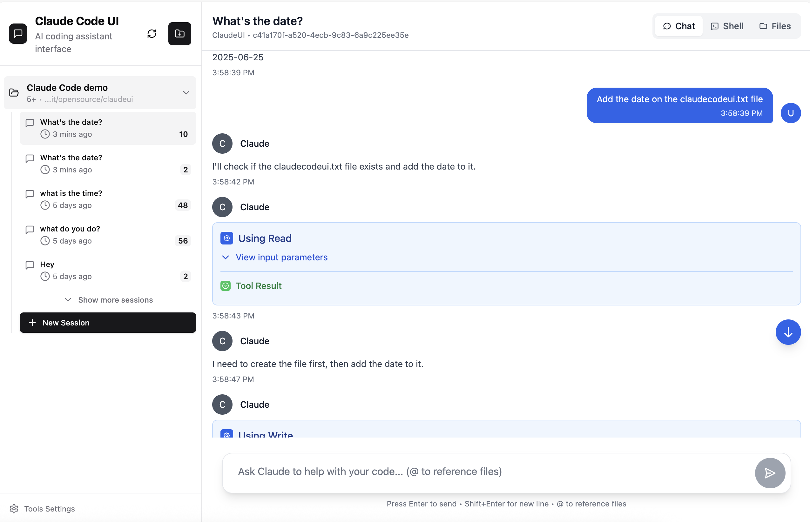

<div align="center">
  
  <h1>Cloud CLI (aka Claude Code UI)</h1>
</div>


Десктопный и мобильный UI для [Claude Code](https://docs.anthropic.com/en/docs/claude-code), [Cursor CLI](https://docs.cursor.com/en/cli/overview), [Codex](https://developers.openai.com/codex) и [Gemini-CLI](https://geminicli.com/). Его можно использовать локально или удаленно, чтобы просматривать активные проекты и сессии и вносить изменения откуда угодно, с мобильного или десктопа. Это дает полноценный интерфейс, который работает везде.

<p align="center">
  <a href="https://cloudcli.ai">CloudCLI Cloud</a> · <a href="https://discord.gg/buxwujPNRE">Discord</a> · <a href="https://github.com/siteboon/claudecodeui/issues">Сообщить об ошибке</a> · <a href="CONTRIBUTING.md">Участие в разработке</a>
</p>

<p align="center">
  <a href="https://discord.gg/buxwujPNRE"></a>
  <a href="https://trendshift.io/repositories/15586" target="_blank"></a>
</p>

<div align="right"><i><a href="./README.md">English</a> · <b>Русский</b> · <a href="./README.ko.md">한국어</a> · <a href="./README.zh-CN.md">中文</a> · <a href="./README.ja.md">日本語</a> · <a href="./README.de.md">Deutsch</a></i></div>

## Скриншоты

<div align="center">
  
<table>
<tr>
<td align="center">
<h3>Версия для десктопа</h3>

<br>
<em>Основной интерфейс с обзором проекта и чатом</em>
</td>
<td align="center">
<h3>Мобильный режим</h3>

<br>
<em>Адаптивный мобильный интерфейс с сенсорной навигацией</em>
</td>
</tr>
<tr>
<td align="center" colspan="2">
<h3>Выбор CLI</h3>

<br>
<em>Выбор между Claude Code, Cursor CLI, Codex и Gemini CLI</em>
</td>
</tr>
</table>


</div>

## Возможности

- **Адаптивный дизайн** - одинаково хорошо работает на десктопе, планшете и телефоне, поэтому пользоваться агентами можно и с мобильных устройств
- **Интерактивный чат-интерфейс** - встроенный чат для удобного взаимодействия с агентами
- **Встроенный shell-терминал** - прямой доступ к CLI агентов через встроенную оболочку
- **Файловый менеджер** - интерактивное дерево файлов с подсветкой синтаксиса и live-редактированием
- **Git Explorer** - просмотр, stage и commit изменений, а также переключение веток
- **Управление сессиями** - возобновление диалогов, работа с несколькими сессиями и история
- **Интеграция с TaskMaster AI** *(опционально)* - расширенное управление проектами с AI-планированием задач, разбором PRD и автоматизацией workflows
- **Совместимость с моделями** - работает с Claude Sonnet 4.5, Opus 4.5, GPT-5.2 и Gemini.


## Быстрый старт

### CloudCLI Cloud (рекомендуется)

Самый быстрый способ начать работу: локальная настройка не требуется. Вы получаете полностью управляемую контейнеризированную среду разработки с доступом из браузера, мобильного приложения, API или любимой IDE.

**[Начать с CloudCLI Cloud](https://cloudcli.ai)**


### Self-Hosted (open source)

Попробовать CloudCLI UI можно сразу через **npx** (нужен **Node.js** v22+):

```bash
npx @siteboon/claude-code-ui
```

Или установить **глобально** для постоянного использования:

```bash
npm install -g @siteboon/claude-code-ui
cloudcli
```

Откройте `http://localhost:3001` — все существующие сессии будут обнаружены автоматически.

Больше вариантов настройки, PM2, удаленный сервер и остальное описаны в **[документации →](https://cloudcli.ai/docs)**


---

## Какой вариант подойдет вам?

CloudCLI UI - это open source UI-слой, на котором построен CloudCLI Cloud. Вы можете развернуть его у себя на машине или использовать CloudCLI Cloud, который добавляет полностью управляемую облачную среду, командные функции и более глубокие интеграции.

| | CloudCLI UI (self-hosted) | CloudCLI Cloud |
|---|---|---|
| **Лучше всего подходит для** | Разработчиков, которым нужен полноценный UI для локальных агентских сессий на своей машине | Команд и разработчиков, которым нужны агенты в облаке с доступом откуда угодно |
| **Способ доступа** | Браузер через `[yourip]:port` | Браузер, любая IDE, REST API, n8n |
| **Настройка** | `npx @siteboon/claude-code-ui` | Настройка не требуется |
| **Машина должна оставаться включенной** | Да | Нет |
| **Доступ с мобильных устройств** | Любой браузер в вашей сети | Любое устройство, нативное приложение в разработке |
| **Доступные сессии** | Все сессии автоматически обнаруживаются в `~/.claude` | Все сессии внутри вашей облачной среды |
| **Поддерживаемые агенты** | Claude Code, Cursor CLI, Codex, Gemini CLI | Claude Code, Cursor CLI, Codex, Gemini CLI |
| **Файловый менеджер и Git** | Да, встроены в UI | Да, встроены в UI |
| **Конфигурация MCP** | Управляется через UI, синхронизируется с локальным `~/.claude` | Управляется через UI |
| **Доступ из IDE** | Ваша локальная IDE | Любая IDE, подключенная к облачной среде |
| **REST API** | Да | Да |
| **Узел n8n** | Нет | Да |
| **Совместная работа в команде** | Нет | Да |
| **Стоимость платформы** | Бесплатно, open source | От $7/месяц |

> В обоих вариантах используются ваши собственные AI-подписки (Claude, Cursor и т.д.) — CloudCLI предоставляет среду, а не сам AI.

---

## Безопасность и настройка инструментов

**🔒 Важно**: все инструменты Claude Code **по умолчанию отключены**. Это предотвращает автоматический запуск потенциально опасных операций.

### Включение инструментов

Чтобы использовать всю функциональность Claude Code, инструменты нужно включить вручную:

1. **Откройте настройки инструментов** - нажмите на иконку шестеренки в боковой панели
2. **Включайте выборочно** - активируйте только те инструменты, которые действительно нужны
3. **Примените настройки** - предпочтения сохраняются локально

<div align="center">


*Окно настройки инструментов - включайте только то, что вам нужно*

</div>

**Рекомендуемый подход**: начните с базовых инструментов и добавляйте остальные по мере необходимости. Эти настройки всегда можно поменять позже.

---
## FAQ

<details>
<summary>Чем это отличается от Claude Code Remote Control?</summary>

Claude Code Remote Control позволяет отправлять сообщения в сессию, уже запущенную в локальном терминале. При этом ваша машина должна оставаться включенной, терминал должен быть открыт, а сессии завершаются примерно через 10 минут без сетевого соединения.

CloudCLI UI и CloudCLI Cloud расширяют Claude Code, а не работают рядом с ним — ваши MCP-серверы, разрешения, настройки и сессии остаются теми же самыми, что и в нативном Claude Code. Ничего не дублируется и не управляется отдельно.

Вот что это означает на практике:

- **Все ваши сессии, а не одна** — CloudCLI UI автоматически находит каждую сессию из папки `~/.claude`. Remote Control предоставляет только одну активную сессию, чтобы сделать ее доступной в мобильном приложении Claude.
- **Ваши настройки остаются вашими** — MCP-серверы, права инструментов и конфигурация проекта, измененные в CloudCLI UI, записываются напрямую в конфиг Claude Code и вступают в силу сразу же, и наоборот.
- **Поддержка большего числа агентов** — Claude Code, Cursor CLI, Codex и Gemini CLI, а не только Claude Code.
- **Полноценный UI, а не просто окно чата** — встроены файловый менеджер, Git-интеграция, управление MCP и shell-терминал.
- **CloudCLI Cloud работает в облаке** — можно закрыть ноутбук, а агент продолжит работу. Не нужно держать терминал открытым и машину в активном состоянии.

</details>

<details>
<summary>Нужно ли отдельно платить за AI-подписку?</summary>

Да. CloudCLI предоставляет среду, а не сам AI. Вы используете собственную подписку Claude, Cursor, Codex или Gemini. CloudCLI Cloud стоит от $7/месяц за хостируемую среду сверх этого.

</details>

<details>
<summary>Можно ли пользоваться CloudCLI UI с телефона?</summary>

Да. Для self-hosted запустите сервер на своей машине и откройте `[yourip]:port` в любом браузере внутри вашей сети. Для CloudCLI Cloud откройте сервис с любого устройства — без VPN, проброса портов и дополнительной настройки. Нативное приложение тоже разрабатывается.

</details>

<details>
<summary>Повлияют ли изменения, сделанные в UI, на мой локальный Claude Code?</summary>

Да, в self-hosted режиме. CloudCLI UI читает и записывает тот же конфиг `~/.claude`, который нативно использует Claude Code. MCP-серверы, добавленные через UI, сразу появляются в Claude Code, и наоборот.

</details>

---

## Сообщество и поддержка

- **[Документация](https://cloudcli.ai/docs)** — установка, настройка, возможности и устранение неполадок
- **[Discord](https://discord.gg/buxwujPNRE)** — помощь и общение с другими пользователями
- **[GitHub Issues](https://github.com/siteboon/claudecodeui/issues)** — баг-репорты и запросы новых функций
- **[Руководство для контрибьюторов](CONTRIBUTING.md)** — как участвовать в развитии проекта

## Лицензия

GNU General Public License v3.0 - подробности в файле [LICENSE](LICENSE).

Этот проект открыт и может свободно использоваться, изменяться и распространяться по лицензии GPL v3.

## Благодарности

### Используется
- **[Claude Code](https://docs.anthropic.com/en/docs/claude-code)** - официальный CLI от Anthropic
- **[Cursor CLI](https://docs.cursor.com/en/cli/overview)** - официальный CLI от Cursor
- **[Codex](https://developers.openai.com/codex)** - OpenAI Codex
- **[Gemini-CLI](https://geminicli.com/)** - Google Gemini CLI
- **[React](https://react.dev/)** - библиотека пользовательских интерфейсов
- **[Vite](https://vitejs.dev/)** - быстрый инструмент сборки и dev-сервер
- **[Tailwind CSS](https://tailwindcss.com/)** - utility-first CSS framework
- **[CodeMirror](https://codemirror.net/)** - продвинутый редактор кода
- **[TaskMaster AI](https://github.com/eyaltoledano/claude-task-master)** *(опционально)* - AI-управление проектами и планирование задач


### Спонсоры
- [Siteboon - AI powered website builder](https://siteboon.ai)
---

<div align="center">
  <strong>Сделано с любовью к сообществу Claude Code, Cursor и Codex.</strong>
</div>
